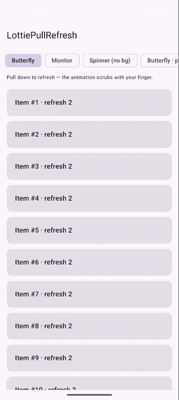
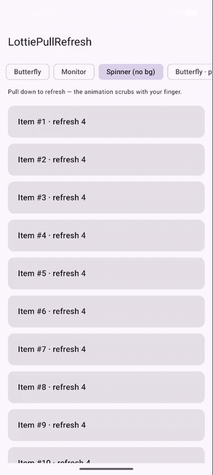
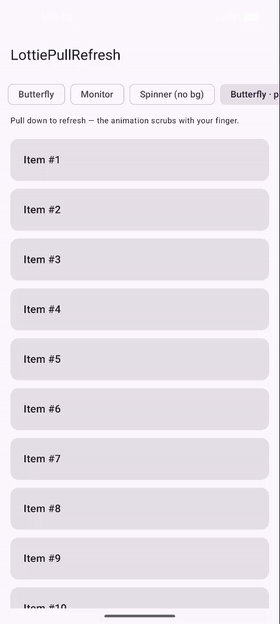

# LottiePullRefresh

A **Compose Multiplatform** pull-to-refresh that uses a [Lottie](https://lottiefiles.com/) animation as
the refresh indicator. Targets **Android** and **iOS**, powered by
[Compottie](https://github.com/alexzhirkevich/compottie) for cross-platform Lottie rendering.

[](https://jitpack.io/#Micoder-dev/LottiePullRefresh)
[](https://www.apache.org/licenses/LICENSE-2.0)
[](#)

This is a from-scratch, pure-Compose re-imagining of the classic view-based
[`LottieSwipeRefreshLayout`](https://github.com/nabil6391/LottieSwipeRefreshLayout) — no Android
`View` system, no Accompanist. Just a `NestedScrollConnection` and a Lottie painter, so it runs
unchanged on every Compose Multiplatform target.

<p align="center">
  
  &nbsp;&nbsp;
  
</p>

<p align="center">
  <em>Pull down → the Lottie animation scrubs 0→1 with your finger → release past the threshold → it loops while refreshing.</em>
</p>

## Features

- 🎯 **Pure Compose** — works on Android & iOS from a single `commonMain` implementation.
- 🪁 **Lottie indicator** — the animation scrubs **live with your finger** as you pull, then loops while refreshing.
- 🧲 **Sticky drag physics** — the same resistance feel as the original view library.
- 🧩 **Composable-first API** — hoistable state (`LottiePullRefreshState`), custom-indicator slot, and
  convenience overloads that take a `LottieComposition` or a raw Lottie JSON string.
- 🎨 **Customizable** — threshold distance, indicator size, circular background, elevation, alignment.
- 🪟 **Overlay or push-down** — `indicatorOverlay = true` floats the indicator over the content;
  `false` pushes the content down so the indicator sits in the gap above it.

The Lottie **scrubs 0→1 with the drag** — it plays forward as you pull down and reverses as you pull
back up (the progress is bound directly to the pull distance), then loops while refreshing. Use a
**vector** Lottie (shapes only); image-backed or precomp/matte-heavy files won't render correctly in
Compottie. The sample demonstrates several styles (a circular butterfly, a monitor-progress ring, a
background-less dot spinner, and a push-down variant).

## Install (JitPack)

**1. Add the JitPack repository** to your root `settings.gradle.kts`:

```kotlin
dependencyResolutionManagement {
    repositories {
        google()
        mavenCentral()
        maven { url = uri("https://jitpack.io") }   // <-- add this
    }
}
```

**2. Add the dependency.** In a Compose Multiplatform module, put it in `commonMain`:

```kotlin
kotlin {
    sourceSets {
        commonMain.dependencies {
            implementation("com.github.Micoder-dev.LottiePullRefresh:lottie-pullrefresh:0.1.0")
        }
    }
}
```

For an **Android-only** project it's the same coordinate in your `dependencies { }` block:

```kotlin
dependencies {
    implementation("com.github.Micoder-dev.LottiePullRefresh:lottie-pullrefresh:0.1.0")
}
```

> **iOS note.** JitPack builds on Linux, which cannot compile Kotlin/Native Apple targets, so the
> JitPack artifact ships the **Android** variant. The full Android **+ iOS** build is published from
> macOS to Maven Central under `io.github.micoder:lottie-pullrefresh`. For an iOS/KMP app, consume it
> from Maven Central; for Android, JitPack is all you need.

Compottie is exposed as an `api` dependency, so `rememberLottieComposition`, `LottieCompositionSpec`,
etc. are available to you without an extra dependency.

## Quick start

The simplest overload takes the raw Lottie JSON and handles everything for you:

```kotlin
@Composable
fun Feed(viewModel: FeedViewModel) {
    val isRefreshing by viewModel.isRefreshing.collectAsState()

    // Load the animation JSON however you like (compose resources, network, assets…).
    val json = /* "{ \"v\": \"5.7.4\", ... }" */

    LottiePullRefresh(
        isRefreshing = isRefreshing,
        onRefresh = { viewModel.refresh() },
        lottieJson = json,
    ) {
        LazyColumn(Modifier.fillMaxSize()) {
            items(viewModel.items) { ItemRow(it) }
        }
    }
}
```

### With a pre-loaded `LottieComposition`

```kotlin
val composition by rememberLottieComposition {
    LottieCompositionSpec.JsonString(json)
}

LottiePullRefresh(
    isRefreshing = isRefreshing,
    onRefresh = { refresh() },
    composition = composition,
    refreshThreshold = 96.dp,
    indicatorSize = 56.dp,
) {
    // content
}
```

See [Modes & styles](#modes--styles) for the overlay vs push-down modes and the background/size options.

### Fully custom indicator

Hoist the state and drive your own indicator via the low-level overload:

```kotlin
val state = rememberLottiePullRefreshState(isRefreshing)

LottiePullRefresh(
    isRefreshing = isRefreshing,
    onRefresh = { refresh() },
    state = state,
    indicator = { s, triggerDistance ->
        LottieRefreshIndicator(
            state = s,
            refreshTriggerDistance = triggerDistance,
            composition = composition,
            background = false,          // draw the raw animation, no circular surface
            indicatorSize = 72.dp,
        )
    },
) {
    // content
}
```

`LottiePullRefreshState` exposes:

| member | description |
| --- | --- |
| `isRefreshing` | whether a refresh is in progress |
| `isSwipeInProgress` | whether the user is actively dragging |
| `indicatorOffset` | current indicator offset in pixels (drive custom visuals off this) |

## Modes & styles

### Overlay (default)

The indicator floats over the content. Swap in any **vector** Lottie and it scrubs 0→1 with the pull.

<table>
<tr>
<td width="55%">

```kotlin
LottiePullRefresh(
    isRefreshing = isRefreshing,
    onRefresh = { refresh() },
    lottieJson = butterflyJson,
    indicatorSize = 48.dp,       // circular butterfly
    // indicatorOverlay = true   // (default) float over content
) {
    LazyColumn { items(rows) { RowItem(it) } }
}
```

Use `indicatorBackground = false` for a background-less indicator
(e.g. the dot spinner), and bump `indicatorSize` for larger art.

</td>
<td width="45%">

</td>
</tr>
</table>

### Push-down

Set `indicatorOverlay = false` and the **content is pushed down** by the pull distance, so the
indicator sits in the gap above it (like the classic Material swipe-refresh).

<table>
<tr>
<td width="55%">

```kotlin
LottiePullRefresh(
    isRefreshing = isRefreshing,
    onRefresh = { refresh() },
    lottieJson = butterflyJson,
    indicatorOverlay = false,     // push content down
    indicatorBackground = true,   // circular surface behind the animation
    refreshThreshold = 80.dp,
) {
    LazyColumn { items(rows) { RowItem(it) } }
}
```

</td>
<td width="45%">

</td>
</tr>
</table>

## API surface

| Declaration | Purpose |
| --- | --- |
| `LottiePullRefresh(isRefreshing, onRefresh, lottieJson, …)` | convenience — loads the JSON for you |
| `LottiePullRefresh(isRefreshing, onRefresh, composition, …)` | pass a pre-built `LottieComposition` |
| `LottiePullRefresh(isRefreshing, onRefresh, indicator, …)` | low-level — bring your own indicator |
| `LottieRefreshIndicator(state, refreshTriggerDistance, composition, …)` | the default indicator |
| `rememberLottiePullRefreshState(isRefreshing)` | remembers/updates the state |

## Project layout

```
LottiePullRefresh/
├── lottie-pullrefresh/           # the library (Android + iOS)
│   └── src/commonMain/kotlin/io/github/micoder/lottiepullrefresh/
│       ├── LottiePullRefresh.kt                     # the container composable + overloads
│       ├── LottieRefreshIndicator.kt               # the default Lottie indicator
│       ├── LottiePullRefreshState.kt               # hoistable state
│       └── LottiePullRefreshNestedScrollConnection.kt  # gesture/physics
└── sample/composeApp/            # Android + iOS sample app
    ├── src/commonMain/           # shared App() + bundled loader.json
    ├── src/androidMain/          # MainActivity
    └── src/iosMain/              # MainViewController()
```

## Running the sample

**Android**
```bash
./gradlew :sample:composeApp:assembleDebug
# then install the APK from sample/composeApp/build/outputs/apk/debug/
```

**iOS** — the shared UI is exposed to Swift via `MainViewController()` in
`sample/composeApp/src/iosMain`. Create an Xcode app that embeds the `ComposeApp` framework and host
it in a SwiftUI `UIViewControllerRepresentable`:

```swift
struct ComposeView: UIViewControllerRepresentable {
    func makeUIViewController(context: Context) -> UIViewController {
        MainViewControllerKt.MainViewController()
    }
    func updateUIViewController(_ vc: UIViewController, context: Context) {}
}
```

> iOS frameworks can only be compiled on macOS with Xcode; the Android artifacts build on any platform.

## Toolchain

- Kotlin 2.2.21 · Compose Multiplatform 1.11.1 · AGP 8.11.0 · Gradle 8.13
- Compottie 2.2.4
- Library `minSdk` 21 · sample `minSdk` 24 (Compose resources requirement)

## License

```
Copyright 2026 Micoder-dev

Licensed under the Apache License, Version 2.0 (the "License");
you may not use this file except in compliance with the License.
You may obtain a copy of the License at

    https://www.apache.org/licenses/LICENSE-2.0

Unless required by applicable law or agreed to in writing, software
distributed under the License is distributed on an "AS IS" BASIS,
WITHOUT WARRANTIES OR CONDITIONS OF ANY KIND, either express or implied.
```

### Credits

- Original view-based library: [nabil6391/LottieSwipeRefreshLayout](https://github.com/nabil6391/LottieSwipeRefreshLayout)
- Gesture model inspired by Google's Accompanist SwipeRefresh (Apache-2.0)
- Cross-platform Lottie rendering: [alexzhirkevich/compottie](https://github.com/alexzhirkevich/compottie)
